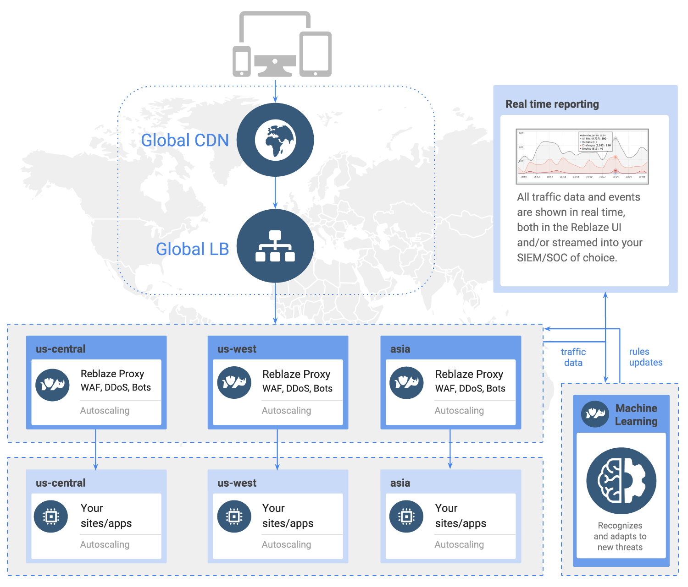
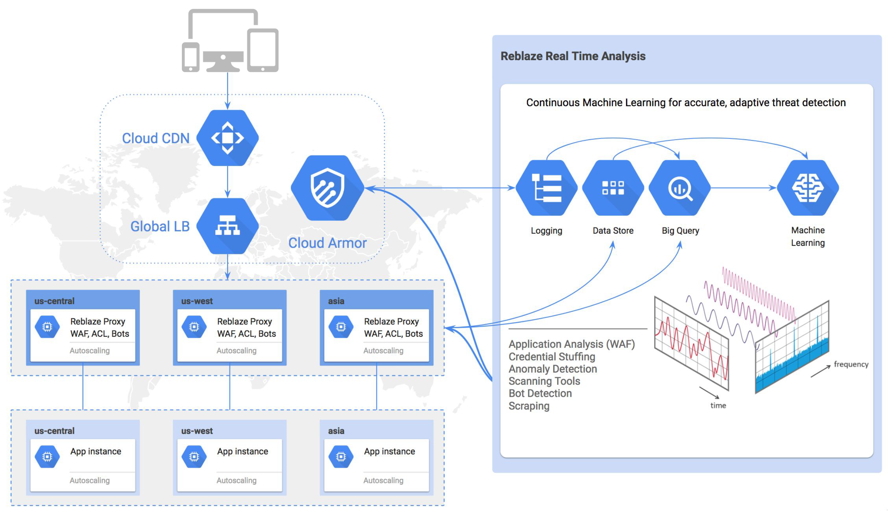
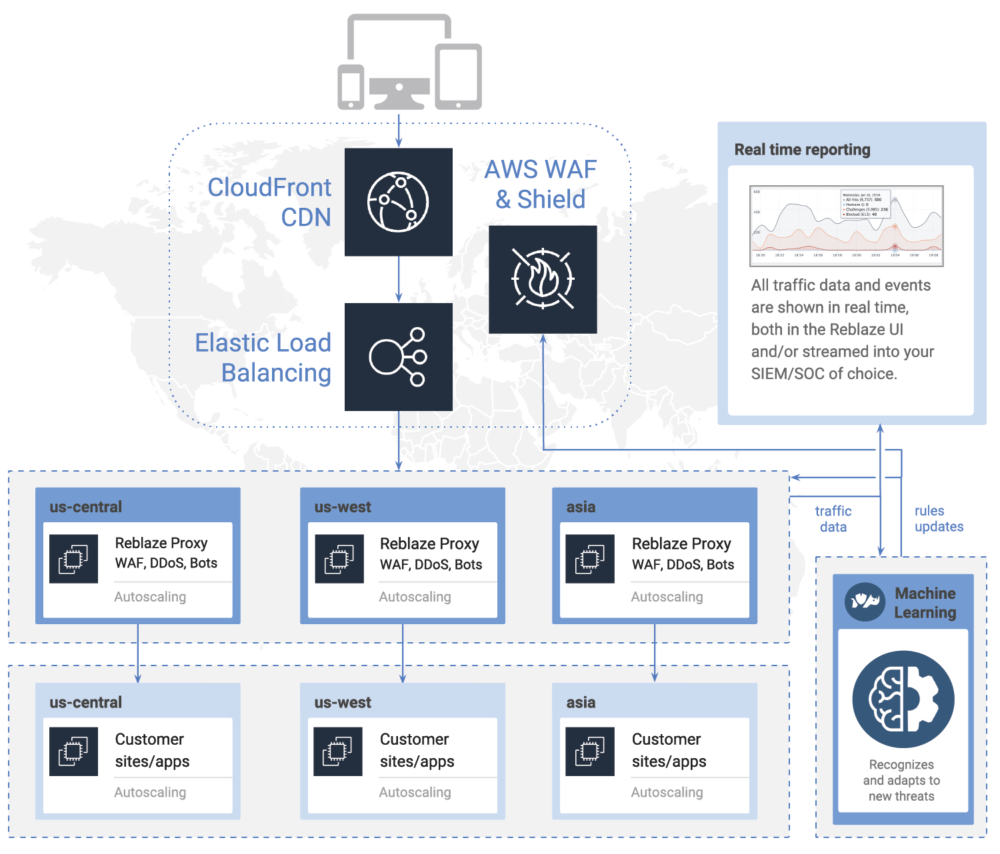
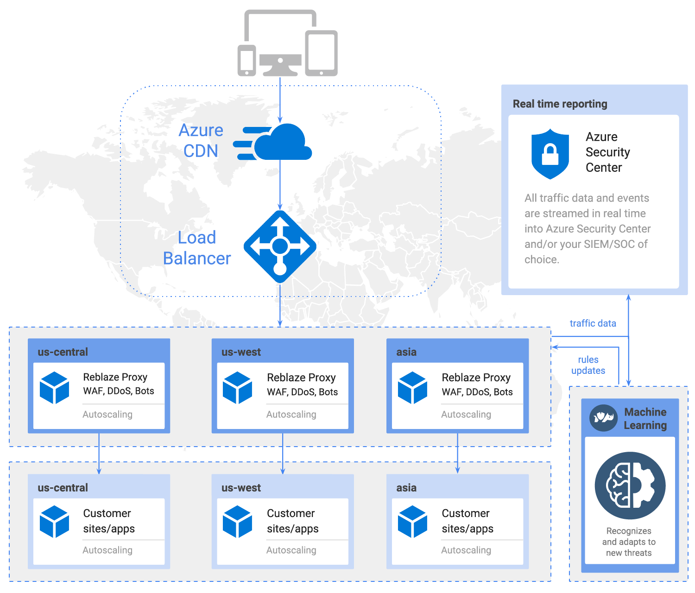

# Introduction to Reblaze

## Welcome!

Reblaze Technologies offers an all-in-one web security platform. It includes a next-gen Web Application Firewall \(WAF\), full-scope autoscaling Denial of Service \(DoS\)/Distributed Denial of Service \(DDoS\) protection, advanced bot management, real-time traffic monitoring & control, full historical logs & analytics, and more. 

Reblaze is fully integrated with the top-tier public cloud providers \(AWS, Azure, and GCP\), and runs on the customer’s clouds of choice. The platform protects web applications, services and microservices, and API endpoints.

The platform is designed around a no-compromise approach to web security. All customers enjoy comprehensive protection, without having to purchase premium tiers or subscribe to additional services. Each customer receives a dedicated Virtual Private Cloud \(VPC\), eliminating multi-tenancy vulnerabilities. For maximum privacy, all traffic data is processed exclusively inside the customers’ clouds. Fine-grained ACLs enable precise traffic regulation. An intuitive web-based management console provides real-time traffic control. Multivariate threat detection, behavioral analysis, and machine learning ensure accurate, adaptive protection. 

## Product overview 

Reblaze deploys as a reverse proxy, geolocated immediately in front of the protected network for minimal latency. As incoming traffic passes through Reblaze, attack traffic is blocked and denied access. The platform's overall architecture is as follows: 

### Cloud-based web security

* Reblaze deploys a dedicated VPC for each customer: an entire full-stack environment for each protected web platform, deployed immediately and automatically, and running across one or more cloud vendors \(usually AWS, GCP and Microsoft Azure, although private clouds are supported as well\).
* All incoming traffic is routed through the VPC and scrubbed as it passes through. Latency is negligible \(generally 1.5 milliseconds or less\). 
* Hostile traffic is blocked before it reaches the protected network. Legitimate traffic has normal access to the requested resources. 
* Attackers cannot reach, or even find, the targeted web platform.
* Bandwidth, compute, and other resources scale automatically as needed, limited only by the capacity of the global cloud. 
* Remote management ensures minimal obligations \(of time or expertise\) from onsite staff.

## Architecture

### Authentication

Reblaze supports various methods of authentication such as Basic, Digest, and Kerberos. \(Note that NTLM cannot work with reverse proxies, and thus Reblaze does not support NTLM sites/applications.\) 

### Processing Within Your Perimeter

With Reblaze, you can process and scrub your traffic exclusively within _your_ clouds—the clouds you already trust for your other business processes. 

### Top-tier Cloud Platforms

Reblaze is integrated with, and runs natively on, multiple cloud platforms, including the top-tiers \(AWS, GCP, and Azure\). It can run on any combination of clouds, on your choice of accounts \(Reblaze’s, yours, or a combination of the two\), and it deploys in minutes. 

Reblaze deploys slightly differently on each platform, to take full advantage of its inherent capabilities.

### GCP

Here is an example deployment of Reblaze on Google Cloud Platform.

Static content is served by the CDN. Incoming dynamic requests are directed through Cloud Load Balancing \(capable of handling millions of requests per second\) to ensure that the request processing time is minimal and availability will be fully utilized. 

Requests are routed through the Auto Scaled instance group of "Reblazers" \(security logic units\) that will inspect the traffic, and according to their security policies, will bypass, deny, or allow the requests. Rule updates are sent to Cloud Armor, which blocks hostile traffic at the edges.

All incoming requests and their disposition are displayed in the console admin, and also streamed into Cloud Security Command Center \(not shown above for lack of space\).

All events and requests are recorded in BigQuery, accessible to users at all times via full historical logs. Cloud Machine Learning is used to analyze the data. Reblaze identifies new traffic and behavioral patterns \(both legitimate and hostile\), and updates all deployments appropriately. Thus, even as new web threats arise, Reblaze hardens itself against them.

All Security policies are stored in secure Cloud Storage and constantly synchronized.

### AWS

Here is an example deployment on AWS. The overall traffic flow and processing is similar to that described above for GCP, although it leverages AWS's native capabilities.

### Microsoft Azure

Here is an example deployment on Azure.

