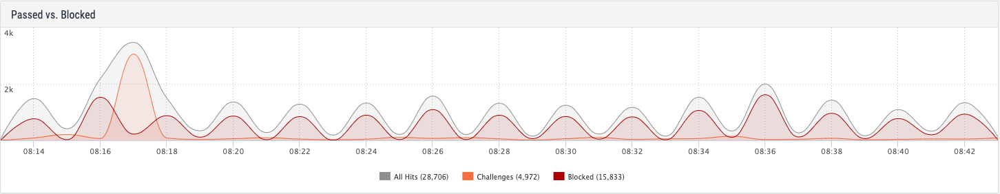
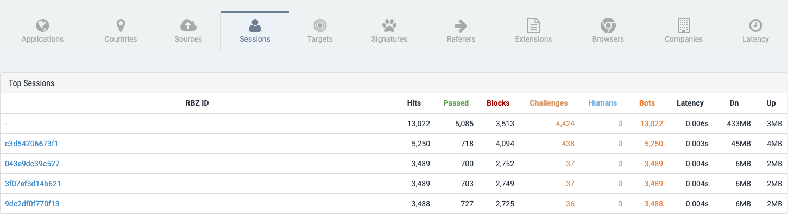

# Traffic Concepts

The Reblaze [Dashboard](dashboard.md) and [View Log](view-log.md) provide intuitive yet very powerful ways of viewing your traffic.

Within those sections, your traffic data is reported in terms of several statistics: 

| Statistic | Comment |
| :--- | :--- |
| **Hits** | Total incoming requests |
| **Humans** | Requests originating from humans. |
| **Bots** | Requests originating from traffic sources not \(yet\) verified to be human. Most of the requestors will be bots, but some will not be. More on this below. |
| **Passed** | Requests accepted by Reblaze and passed upstream to the **origin** \(i.e., the web server, API endpoint, etc.\). |
| **Blocks** | Requests deemed to be hostile, and blocked. |
| **Challenges** | Requests that were challenged. The [challenge process](traffic-concepts.md#the-challenge-process) is an important part of Reblaze's traffic processing, as seen below. |

The Dashboard provides a variety of ways to view your traffic. Most of them do not include all of the above metrics in the same view \(as in the first screenshot below\), but some do \(as in the second screenshot below\).

Reblaze processes "web" requests \(http/s traffic for a web site or application\) differently than API requests from a mobile/native application. Mobile applications have different methods of client authentication, as discussed here: [Mobile SDK](../../using-the-product/reblaze-api-1/mobile-sdk.md). 

The discussion below is for sites and web applications.

## The Challenge Process

When Reblaze receives the first request from a previously unknown traffic source \(below described as the "user"\), this is the typical process that is followed.

1. Reblaze challenges the user's browsing environment. Reblaze uses a variety of proprietary, multi-faceted techniques to verify that this requestor is a human using a browser, instead of a bot using a headless browser or emulator. \(This topic is discussed in some depth in this white paper: [2019 State of Bot Protection](https://www.reblaze.com/resources/white-papers/2019-state-bot-protection/).\)
2. If the challenge is not passed, the request is deemed to be a bot, and if Reblaze has been configured to reject bot traffic, the request is blocked. Nothing more happens.
3. If the challenge is passed, the browser's session is authenticated, and the browser receives cookies from Reblaze.
4. The browser then automatically resubmits the original request, but this time, the cookies are included. The user is granted access to the requested URL, resources, etc.

This process happens quickly \(in a few milliseconds\), and is **invisible** to the user.  


As noted above, this is the "typical" process that occurs in normal use. There are a variety of situations in which it might not be followed.  For example, sometimes Reblaze is configured to whitelist certain IP addresses, and not to challenge them. Another example: if Reblaze is in ["Report Only" mode](../settings/web-proxy/security-profiles.md#enabling-report-only-mode), then in step 2, a bot will be reported, but it will not be blocked. 

The discussion below will be based on the typical process described above.


## How Requests Are Reflected in Reblaze's Statistics

The process described above will result in the following statistics being incremented.

If the challenge was not passed:

* **Hits**
* **Challenge**
* **Bots**

If the challenge was passed:

* **Hits** 
* **Challenge**
* **Bots** \(see explanation below\)
* **Hits** \(incremented a second time for the post-challenge resubmission of the request\)
* **Passed**
* **Humans**

## Counting Bots


**Within Reblaze, a request that does not have authenticating cookies is counted as a bot.**


As a result, the Bot count can sometimes be incremented even when the visitors are humans. Examples:

* When a human user visits a Reblaze-protected site for the first time, **the first request does not yet have the authenticating cookies**. 
* Static files \(images, etc.\) are often exempted from challenges for performance reasons. Direct requests for those URLs from a new visitor will not have cookies.
* Sometimes, trusted IPs are whitelisted and exempted from challenges. They never receive authenticating cookies.

Therefore, although _most_ of the Bot count represents non-human requests to your web application, the Bot metric is not an _exact_ count of this. 

## Relationships of Traffic Metrics

When working with Reblaze's traffic statistics, the following relationships can be helpful.

### **Hits = Passed + Blocked + Challenges**

### **Hits = Humans + Bots**

## Active Challenges versus Passive Challenges

The process described on this page is the **active** challenge process. Out of the box, this is the challenge process that Reblaze uses.

We recommend that if possible, customers switch to the **passive** challenge process instead. 

Passive challenges have two primary benefits:

* They enable much more powerful bot detection.
* They can replace active challenges, which in some circumstances, can adversely affect certain statistics in metrics such as those provided by Google Analytics.

To learn more about passive challenges, go here: [Enabling passive challanges ](../../using-the-product/best-practices/enabling-passive-challenges.md)

