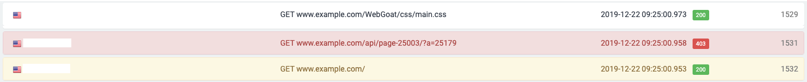
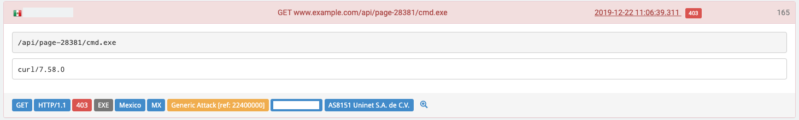

# View Log

This page provides the ability to review and analyze the most recent traffic, up to and including real time. At first glance, you'll see the origin country, IP address, HTTP message type, the targeted location, time stamp, and status code. 

If a security event occurs, this page will allow you to quickly find its root cause.

On the top right of the page, you can select the range of requests displayed: from the most recent 200 events up to the most recent 2500. Choose the desired range \(200, 500, 1000, 1500, 2000, or 2500\) and then click on the checkmark to set the display. 


In the screenshots below, IP addresses are censored for privacy reasons. 


## Analyze Traffic Log

The main tool in this section is the Query box for filtering the display; this is quite similar to the one on the Dashboard. It allows you to filter the display and see only the data you wish to analyze. For a full explanation of how to use it, [click here](../../using-the-product/best-practices/reblaze-filter.md). 


The Query box allows you to filter and display specific requests and their details. To show the results graphically instead, you can copy the filter string and paste it into the Query box on the [Dashboard](dashboard.md).


At the top right of the screen, you can choose the application you want to analyze. The drop-down menu allows you to search for and choose your desired application. 

Next to the Query box, you'll see several buttons. 

* The search icon is for applying the requested filters on the log. \(Or, just hit "Enter" on the keyboard after typing your query.\)
* The calendar button allows you to specify a certain date or period of time.
* The Search History button displays your recent searches, so you can re-run them without having to enter them completely from scratch.
* Export to CSV creates a text-based spreadsheet file.
* The Help button opens a display with a quick-reference guide to Query box operator syntax.
* The Clear button removes your current Query box entries.

## Log Structure

Log entries are color-coded depending on their type.

* **Passed requests:** Black text on a white background.
* **Blocked by Reblaze:** Red text on a red background.
* **Blocked by origin** **\(i.e., the upstream server\):** Red text on a white background.
* **Challenge:** Brown text on a yellow background.

Clicking on any log entry will display its details: 

This will reveal:

* The URL that was requested
* The user agent
* Optional additional information \(not shown in the example above\), depending on the request. Example: the referrer.
* A row of colored labels.

In the example above, the colored labels contain the following information \(from left to right\):

1. **HTTP Request Method** \(GET / POST / PUT...\)
2. **HTTP Version**
3. **HTTP Response code, and which server sent the code:** either the upstream server \(noted as "Origin," as in the example above\), or the Reblaze proxy.
4. **Resource** that was requested \(JPG / PNG / HTML / JS, etc.\)
5. **Origin Country and Country Initials**
6. **Block reason:** The reason, if any, that the request was denied. Standard reasons are listed in the [Reblaze WAF Signatures](../../reference-information-1/reblaze-signatures.md) list, while others are constructed dynamically \(e.g., from a rate limit\). A hyphen \("-", as in the example above\) means that the request was not denied. 
7. **IP Classification:** Whether the requestor is using an IP from a cloud provider, VPN, TOR, etc. In the example above, the requestor is using a cloud provider. Note that this does not indicate that the request was blocked for this reason. If the current Profile had included an ACL to block cloud users, then the Block reason would say "acl:cloud", and then this "Cloud" notification would appear after it for the IP Classification.
8. **Origin IP address** \(censored in the example above\)
9. **Autonomous System Number** \(organization/ISP/etc.\)

To see full log details for an entry, click on the small magnifier on the right side of the log. This will show all the headers, cookies, and session details. 

The example above shows a request that was answered with a challenge. It came from a known cloud provider, by curl, to www.example.com.  

The above screenshot shows a log entry for a request that was blocked. Note that the Block reason is "Generic Attack \[ref 22400000\]". The "ref" number is a [Reblaze Signature reference ID](../../reference-information-1/reblaze-signatures.md). 

## Examples for Log Filters

### **Example 1**

How to search for one IP \(censored in the screenshot below\), only showing requests with a GET method during a specific time frame.

### **Example 2**

Using this regex syntax: 

`status:[4]\d\d`

Provides all status codes for 4xx. 

### **Example 3**

How to display all requests from a certain country, for "EXE" files, which produced error code 403. 


A full explanation of filter syntax, a listing of operators, and tips for quickly building queries is found here: [Using the Reblaze Query Box](../../using-the-product/best-practices/reblaze-filter.md). 


## Using the Log

The View Log page has many uses, and it will allow you to learn a lot about your traffic. 

This page is a powerful tool for traffic control, and is especially useful when you are first starting to use Reblaze. By revealing the composition of your traffic, it can help you decide which requests you should begin blocking.

