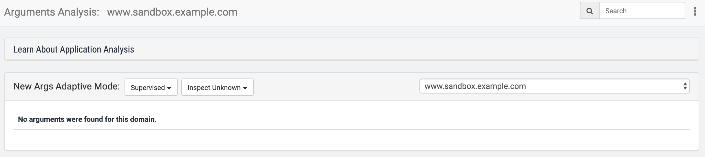
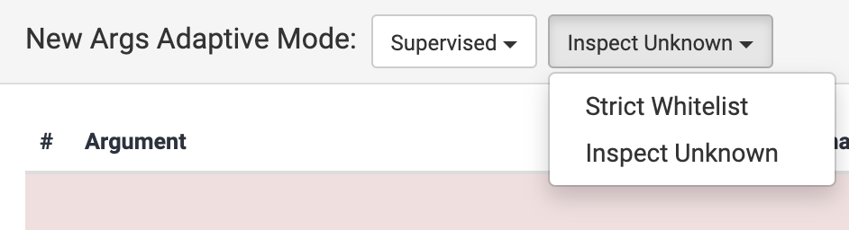

# Args Analysis

The Arguments Analysis feature has two primary functions:

1. **Examining incoming requests for specific whitelisted characters** in specific arguments \(i.e., parameters in the URL query string or within the request body\). Alphanumeric characters are allowed by default; all others must be allowed via a whitelist. When all characters in all arguments are found in the respective whitelists, the request is allowed, and no further inspection or filtering by the WAF is performed. If one or more characters are encountered that are not whitelisted, the request is either forwarded to the WAF for further inspection \(when **Inspect Unknown** mode is enabled\), or the request is denied \(when **Strict Whitelist** mode is enabled\). 
2. **Automatically updating the whitelists:** As non-whitelisted characters are encountered, they can be added to the argument whitelists, depending on the **Adaptive Mode** selected. 

The first function is often used in complicated sites; it offers a positive-security approach for analyzing traffic. Arg Analysis makes it easy to whitelist values that should be allowed in various request parameters. Another possible use is to bypass specific parameters that are too long for the WAF to efficiently process, or where WAF inspection is not relevant.

The second function \(i.e., automatically updating whitelists\) is less applicable for most deployments, and in most situations, is **not encouraged**. If Args Analysis is used incorrectly, large whitelists can be inadvertently built that will match most or all incoming requests. Thus, most or all incoming requests will bypass the WAF's traffic inspection and be sent directly upstream. In effect, this will disable Reblaze's traffic scrubbing. Therefore, **we discourage the use of this function unless you are sure you need it, and you fully understand how it works.**

For both functions, an argument list must be built. 

## Building an Argument List

Initially, this section will look like this:

Note the pulldown list on the right, which specifies the domain that you are currently administering.

### Automatic Argument Learning

Each time the system performs an analysis, **arguments that were not previously known will be learned and added to the argument list, automatically** \(even in Supervised mode\). The new character whitelists will consist of those characters that were encountered with each argument.


This can have some important and potentially nonintuitive consequences. See the warning below in the discussion of [conflicted arguments](args-analysis.md#processing-of-unmatched-characters).


### Manual Argument Addition

In the top right menu you will see this button: . Clicking on it will open the main menu**:**

**Upload arguments file:** The system allows you to upload a HAR file \(that can be recorded using the browser’s dev tool\). From the HAR file, the system will learn all the arguments and their values.

**Creating an argument manually**: You can also create individual arguments by selecting "New Argument," after which this dialog will appear:

| Field Name | Description |  |
| :--- | :--- | :--- |
| **Argument Name** | The parameter in the query string or request body |  |
| **Argument Characters** | A regex pattern to match against the values specified for the Argument Name. This is a whitelist of allowable characters. |  |
| **Max Length** | Maximum allowed length of the argument, in characters |  |

When an argument is encountered in a query string or request body, its Argument Name is sought within the Args list for the relevant domain. If not found, it is added to the list, as noted previously.

If found, its value is analyzed. If each character within it is found in its corresponding Argument Characters, then this argument is passed.

If every argument in a query string or request body is passed, then the entire request is passed. It is sent to the origin \(the upstream server\), without being subjected to further inspection or filtering by Reblaze.

if the request is not passed, further processing occurs. See [Handling Requests with Unmatched Characters](args-analysis.md#handling-requests-with-unmatched-characters), below.

## Argument List Administration

In addition to the "New Argument" and "Upload Arguments File" options, the pulldown menu also offers additional capabilities.

**Download as JSON -** When this option is selected, the system will start a browser download of a JSON file that contains all the arguments and their values.

**Delete App Args -** Removes all the arguments in the current domain.

**Analyze Now -** Manually triggers the analysis process \(described below\), starting from the previous day.

**Learning Resources**  - Displays the list of all [ACL Policies](profiles/acl-policies.md) defined in your planet, except for the default ones supplied by Reblaze. Example:

By default, Args Analysis learns from every request. The Learning Resources feature allows you to filter this, so that it only learns from specific requests.

When you select an ACL Policy from this list, Args Analysis will be limited to the requests which match that Policy. \(If the ACL Policy happens to be empty, then the most recent 100,000 requests will be analyzed, or the most recent 24 hours' worth of data, whichever limit is reached first.\)

If the selected ACL Policy has an Operation of Allow, then Args Analysis will analyze all the requests that were not blocked by the WAF or other ACL Policies. If the Policy is instead set to Bypass, then Args Analysis will also learn from blocked requests. \(This can be useful when in Report-Only mode\).

**Show Regex/Characters -** Toggle the display of all values on this page in regex, and then back into characters. Note when showing regex, alphanumeric characters are also explicitly included in the whitelist. In character mode, the Reblaze interface does not display these; the user should understand that all alphanumerics are whitelisted by default.

**Refresh and Discard Changes -** This allows you to discard all the changes you made to the arguments table.

**Save Changes -** When making any changes to the arguments table, you must save them afterward. This includes any modified or accepted conflicts in the system \(more on these below\).

## Once Argument Lists Are Built

In daily operation, Reblaze analyzes arguments in incoming requests. When they match the character whitelists, the requests are allowed, as described above.

Additionally, Reblaze goes through the traffic logs, analyzing and mapping all arguments received since the last analysis. This occurs every night around 3am UTC.

The system creates a list of argument characters that were encountered in requests, but were not in the whitelists. 

Then in this Args Analysis section of the interface, Reblaze displays the current whitelists as follows:

* **Unchanged Arguments**: This is at the bottom of the screen. It shows all the arguments for which Reblaze did not encounter any new \(i.e., non-whitelisted\) characters.
* **Conflicted Arguments**: This shows the results of the most recent analysis: all the arguments for which Reblaze encountered characters that were not in the whitelists. 

Here you have the opportunity to update the whitelists, accepting some or all of the proposed updates listed in the Conflicted Arguments section.

The manner in which these updates are accepted or rejected will depend on the **New Args Adaptive Mode**.

## New Args Adaptive Mode 

There are four possible modes: Automatic, Supervised, Locked, and Preview.

### **Automatic**

The system will discover and deploy new args without any human intervention. Everything occurs automatically.

### Supervised

The system will discover new args, but it will not deploy them. Instead, it will present them as Conflicted Arguments, and await approval or rejection by a human admin.

### Locked

The system will not discover any new args. All configuration changes must be done manually.

### Preview

The system will discover new args, but this is for informative purposes only. Traffic processing is not affected.


In the interface, there is a help section that lists the first mode as  **Automatic \(Recommended\)**. This is deprecated; **we no longer recommend Automatic mode** for most customers. As mentioned previously, this introduces the risk that erroneously large whitelists will be built. For most customer deployments, **we now recommend Supervised or Locked mode**.


## Handling Requests with Unmatched Characters

For each of the first 3 operation modes \(Automatic, Supervised, and Locked\), another setting is available:

This defines Reblaze's behavior when non-whitelisted characters are encountered for known args.

#### Inspect Unknown

A request that contains an argument that contains one or more non-whitelisted characters will be forwarded to the WAF for inspection and potential filtering.

#### Strict Whitelist

A request that contains an argument that contains one or more non-whitelisted characters will be blocked.

After the request is processed, this argument is added to the list of **Conflicted Arguments**.

## **Conflicted Arguments**

When new \(non-whitelisted\) characters are encountered, the arguments in which they were found are listed in the interface as Conflicted Arguments. Reblaze suggests updates \(the New Values\) for each argument's whitelist, and awaits the user's decisions.

Every time an analysis is performed, the previous list of Conflicted Arguments is discarded, and a new one generated. Thus, the interface displays only the Conflicted Arguments that were found in the most recent analysis. 


Sometimes, argument names contain a designation for an ampersand \("amp;"\), while others do not. This results from differences in decoding URLs versus arguments found in the body. It doesn't affect anything within the interface or its usage. 


Each Conflicted Argument contains a set of New Values. These are updates that Reblaze is proposing to make. There are three available actions: 

* Deleting 
* Modifying
* Accepting

**Deleting -** selecting the Trash icon will remove the Conflicted Argument from the list. **This can produce unintended consequences: see warning below.**

**Modifying -** You can edit the New Values. For the character field, only valid regex will be accepted.

**Accepting** - Clicking on the green Accept Conflicts button will accept all the Conflicted Arguments, updating the args list to the New Values.


It might appear that the "Delete" command \(the trash can button\) is merely a method of resolving the Conflict by rejecting the New Values and retaining the Current Values. **This is incorrect.** 

When an argument is deleted from the list of Conflicted Arguments, this does not remove the _conflict_, it removes the _argument_. **This has two consequences, both of which might not be intended by the user:**

1. Until the next analysis is run, this argument will be unknown to Reblaze. Therefore, every incoming request that contains it will either be sent to the WAF for further inspection \(when **Inspect Unknown** mode is enabled\), or it will be denied \(when **Strict Whitelist** mode is enabled\).
2. When the next analysis is performed, Reblaze will learn the "new" argument, and create a new whitelist containing whatever characters were encountered within it. It's possible that this whitelist will contain some or all of the characters that previously caused that argument to appear as Conflicted.

The second point is especially important. If the user thinks that "Delete" will reject the New Values, **the opposite can actually occur**. When the argument is deleted and subsequently re-added, its character whitelist might automatically contain the same characters that the user was trying to reject previously.

**The correct way of resolving a Conflict while retaining the same whitelist is to edit the New Values to match the Current Values**, before selecting Accept Conflicts**.** 

Or, the user can do nothing, and merely leave the Conflict unresolved in the interface. This will leave the argument's whitelist unchanged.  


## Unchanged Arguments

At the bottom of the screen is a list of Unchanged Arguments.

This shows the arguments for which Reblaze has not encountered any non-whitelisted characters. 

You can edit these arguments if desired, or even delete them \(by clicking on the trash icon to the right—but **see the warning above about the potential consequences of deleting arguments**\).

