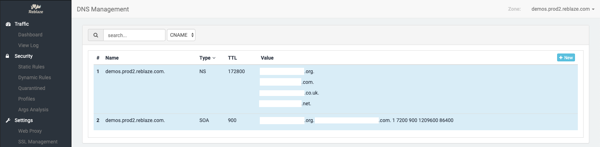

# DNS

DNS Management is an optional capability. Your DNS management does not need to be done within Reblaze, but it can be. 

Reblaze provide a full DNS service, based on[ AWS Route 53](https://aws.amazon.com/route53/). Reblaze also supports DNS on other cloud platforms, but they are not yet supported natively within the Reblaze interface. If you need this capability within your deployment, [contact support for assistance](../../support.md).

### Motivation

Many site administrators use their domain registrars as their DNS providers, but this is often a poor choice. In general, domain registrars do not place a high priority on DNS security \(since DNS management is not a primary part of their business model\), and attackers frequently target their DNS servers. A successful DNS poisoning attack can result in your site getting hijacked.

Managing your DNS through a secure platform like Reblaze is a far better choice. This ensures your full stack is protected—even the DNS layer.

A full explanation of DNS setup is beyond the scope of this Manual. The discussion below is an overview of Reblaze's capabilities and interface. Please [contact support](../../support.md) if you need assistance for your particular situation.  

## Scope

You can manage millions of DNS zones and records using the Reblaze interface.

The DNS Management feature of Reblaze is for both external and internal DNS administration. Internally, Reblaze maintains a special name for every planet \(planetname.prod2.reblaze.com\), and every domain protected by Reblaze is mapped to an entry in this domain. This system can also be used for domains accessible externally.

## Administration

As shown in the example screenshot, this page is divided into two sections. The upper section is blue, and lists two special resource recordsets: SOA \(Start Of Authority\) and NS \(Name Server\). These are at the Zone level, and once created, these cannot be modified. They also will not be filtered \(hidden from view\) by the "search" feature.

The "search" feature is based upon the text box at the upper left. 

This will control the DNS entries being displayed, by filtering them according to the search value and selected record type. Note that filtering does not apply to the entries in the blue section; these will always be displayed.

To add a new DNS entry, click on the "New" button on the right hand side. The following dialog is displayed:

Once a record has been created, it can be deleted \(via the trash icon shown to the right of its entry in the list\) or edited \(via the blue edit icon shown to the right of its entry in the list\). 

### Supported Record Types 

Reblaze supports the following types of DNS records: 

| Record Type | Description |
| :--- | :--- |
| A | Address record |
| AAAA | IPv6 address record |
| CNAME | Canonical name record |
| MX | Mail exchange record |
| NS | Name server record |
| PTR | PTR resource record |
| SOA | Start of \[a zone of\] authority record |
| SPF | Sender policy framework \(now discontinued, as of RFC 7208\) |
| SRV | Service locator |
| TXT | Text record |
| ALIAS CNAME | Alternative to CNAME that can coexist with other records on that name. |

Expected formats for the respective values are given below.

### A Record Type 

The value for an A record is an IPv4 address in dotted decimal notation.

Example: 

`example: 192.150.2.1`

### AAAA Record Type 

The value represents an IPv6 \(128bit\) address in a colon separated notation. 

Example: 

`20541:0da8:85a3:0:0:8a2e:0370:7334`

### CNAME Record Type 

A CNAME value is a domain name. 

Example: 

`www.sample.com`

### MX Record Type 

Each record includes a priority \(integer\) and an email server domain name. It is possible to add multiple records. 

Example: 

`10 mail1.sample.com`

`20 mail2.sample.com`

### NS Record Type 

Delegates a DNS zone to use the given authoritative name servers. \(It is possible to include multiple name servers.\)

Example: 

`ns1.amazon.com` 

`ns2.amazon.org` 

`ns3.amazon.net` 

`ns4.amazon.co.uk`

### TXT Record 

Includes a text record. \(Enclose the text in quotation marks. Multiple entries are allowed.\)

Example: 

`"test1"`

`"test2"` 

### SPF Record 

SPF records were formerly used to verify the identity of the sender of email messages. It's now deprecated, and a TXT record should be used instead. 

Example: 

`"v=spf1 ip4:192.168.0.1/16-all"`

### SRV Record 

A generalized service location record, used for newer protocols instead of creating protocol-specific records such as MX.

The syntax is based on the following: \[Priority\]\[Weight\]\[Port\]\[Domain Name\]

Example: 

`2 12 5050 sip-server.example.com`

`3  15 5060 network.example.com` 

### **PTR Record**

Pointer to a canonical name. Unlike a CNAME, DNS processing stops and the name is returned.

Example: 

`www.example.com`

|  |
| :--- |

