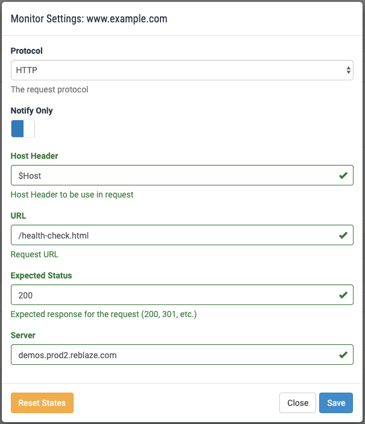
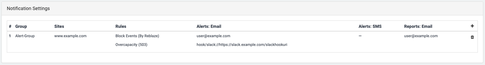
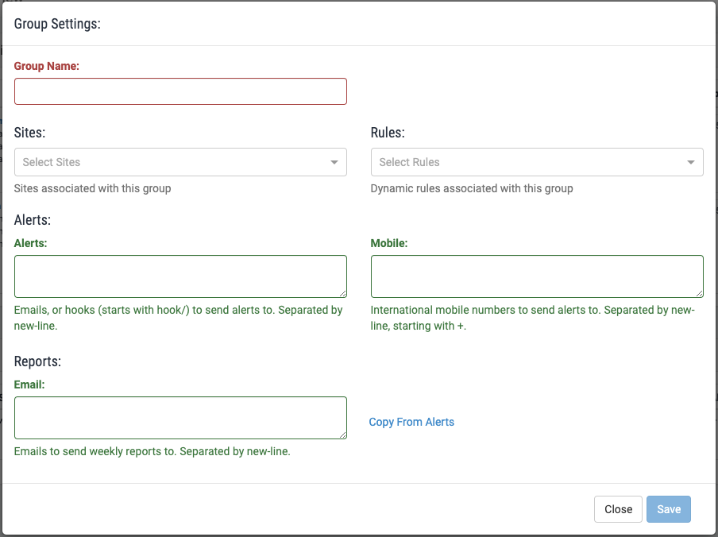

# Planet Overview

The Planet Overview page enables the following actions: 

1. Managing your planet's sites/applications. 
2. Configuring a site/application's health monitoring.
3. Making a site/domain active, or inactive \(in "Report Only" mode\). 
4. [Publishing configuration changes.](../../using-the-product/best-practices/publish-your-changes.md)
5. Configuring Notifications and Alerts.

Note that in the discussion below, "site" and "web application" are synonymous.



This section allows you to add and modify web applications. It does not provide the ability to delete them.


Deleting a web application is done in the General Settings on the [Web Proxy](web-proxy/web-proxy-general-settings.md#site-deletion) page.


## Adding a Web Application 

Creating a new web application is done by duplicating an existing one, and then editing the one that is created. 

* Select an existing site that is the most similar to the one you want to add.
* On the far right part of the screen, click on its "Duplicate" button.
* This will clone the site and create a new one with identical settings, which you can then edit.

## Editing a Web Application

Clicking on a site name will open it in the [Web Proxy](web-proxy/) page, where those settings can be edited. 

### Making a site active or inactive \("Report Only" mode\)

Each web application has two possible Security modes: 

| Security Mode | Description  |
| :--- | :--- |
| **Active** | The WAF will log all traffic, and actively block traffic deemed to be hostile. |
| **Report** | The WAF will log all traffic, including reasons that requests are deemed to be hostile, but will not block anything.  |


Please note that the security mode applies only to the WAF & ACL**.** **Regardless of its setting, Static Rules are still enforced, and challenges will also occur** \(except for those locations/resources which have had a "no challenge" profile assigned to them in the [Security Profiles](web-proxy/security-profiles.md#assigning-security-profiles-to-resources-and-locations) section\). 


### Generating a New SSL Certificate 

Reblaze integrates with [Let's Encrypt](https://letsencrypt.org/) to provide free SSL Certificates. 

By clicking on the "Gen Cert" button at the end of an entry in the site list, you can:

* Generate a new certificate without attaching it to a site
* Generate a new certificate and immediately attach it to a site. If the site has an existing certificate, it will be replaced by the new one.

In either case, this is the dialog you will see: 

Just choose the button for the activity you want.

### Configuring Health Monitoring

In a typical deployment, incoming traffic is load-balanced, processed by Reblaze, and then \(if it is legitimate\) passed through to the upstream origin. 

Load-balancing includes more than just equal distribution of loads; it also includes failover. To perform this correctly, the health of the upstream origin must be monitored.

In this section of the interface, you can define a URL within your site that can be queried by the load balancer. If the URL is accessed successfully, the site is assumed to be healthy and capable of handling a continuing load. If the URL is not accessed successfully, the site is deemed to be unhealthy; depending on the configuration, a failover process might then begin.

To set up health monitoring for a site, click on its "\[Health\] Monitor" button: . Doing so will open this dialog:

Here are the available settings. Check marks at the end of certain fields indicate that the entries are valid.

| **Setting** | **Description** |
| :--- | :--- |
| Protocol | Options are **Do Not Monitor**, **HTTP**, and **HTTPS**. HTTP is offered as a faster option \(compared to HTTPS\) for a static resource where an insecure connection would have no potential consequences. If HTTP is selected for health monitoring, it will not be overridden by any specification elsewhere within the Reblaze interface to use HTTPS.   |
| Notify Only | Enabled \(displaying as blue\) by default. When enabled, an unsuccessful health check only results in a notification being sent \(and another notification will be sent when the first subsequent health check succeeds\); traffic is not failed over to other servers. This is the default setting, because many customers do not have more than one upstream. Even when more than one upstream exists, disabling this setting can mean that upstreams get taken offline as the result of network issues. |
| Host Header | The header for the request. Default is $Host. |
| URL | The URL of the resource that should be requested to verify health. |
| Expected Status | HTTP status code to use in the response to the request. |
| Server | The server where the resource's URL is located. |

#### Reset States

This button resets the health statuses that are displayed in the interface. It does not trigger a health check; it merely resets the status displayed to the user.

For example, a user has disabled health monitoring for a particular upstream server. \(Perhaps it has been intermittently failing its health check.\) However, its most recent status was "failed," and so its IP address is appearing as red in the interface. To remove this distraction, the user clicks on Reset States. The IP address will now be showed normally. 

## Notification and Alert Settings 

At the bottom of the Planet Overview are the Notification Settings.

When a [Dynamic Rule](../security/dynamic-rules.md) is violated, Reblaze can send immediate alerts to a list of one or more email addresses, SMS numbers, and hooks \(e.g., Slack\). 

In addition, a cumulative report of the previous week's violations can be sent to one or more email addresses. 

This section defines one or more **Notification Groups** for these notifications. Clicking on the "**+**" button on the right will display this dialog:

The settings for a Notification Group are as follows.

| Setting | Description |
| :--- | :--- |
| Group Name | A name you choose for display in the Group listing. |
| Sites | The site\(s\) for which alerts will be sent. To include multiple sites, select them one by one from the dropdown list. |
| Rules | The Dynamic Rules which, when violated, will trigger alerts. To include multiple Dynamic Rules, select them one by one from the dropdown list. When more than one rule is included, a violation of one or more will trigger the notification. |
| Alerts | Information for the recipients of alerts: their email addresses, hooks, and mobile numbers for SMS messages. |
| Reports | Email addresses for the recipients of cumulative weekly reports.  |

An existing Notification Group can be edited by clicking on its listing, or deleted by clicking on the trash button at the right end of its listing.



