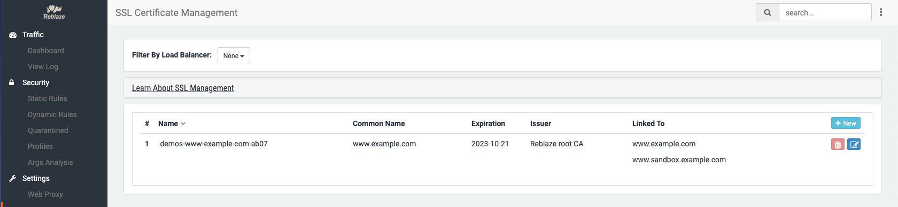
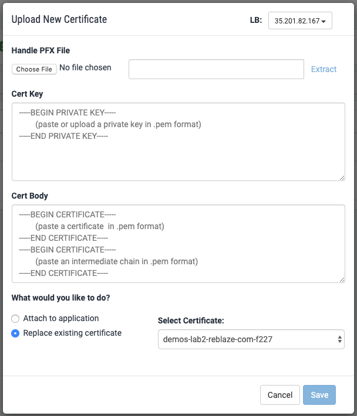
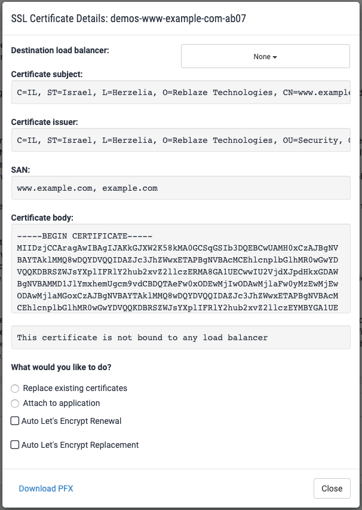

# SSL Management

## Introduction

This section allows you to manage your SSL Certificates. You can create, edit, attach, and remove certificates. The certificates themselves can be uploaded and stored into Reblaze's cloud, or a cloud load balancer.

#### A note on certificates and sites

If you are reading this Manual as part of an initial evaluation of Reblaze, and if you have large numbers of certificates to manage, you should know that Reblaze treats certificates differently than most other security solutions. 

It's not unusual for some companies \(especially SaaS platforms\) to have dozens or even hundreds of certificates to manage. Unfortunately, most security solutions treat each SSL Certificate as a separate "site," and they charge their customers on a per-site basis. Thus, these solutions can be extremely expensive. 

Contrary to this, Reblaze does not treat certificates as sites. A certificate is merely a certificate. For customers with tens or hundreds of certificates to manage, Reblaze's monthly pricing can be one or two orders of magnitude less than its competitors'.

## Section Overview 

The SSL Certificate Management interface displays certificates according to the load balancer to which they are attached. Those stored in the Reblaze cloud are listed as "None."

Displayed parameters are:

| Parameter | Description |
| :--- | :--- |
| **Name** | A unique identifier for use elsewhere in the interface. |
| **Common name** | The domain name for which the certificate was created. It can be a single domain \(“www.example.com”\) or a wildcard expression. For example, “\*.example.com” will match “example.com” and all its subdomains. |
| **Expiration** | When the certificate expires. |
| **Issuer** | The source of the certificate. |
| **Linked To** | This field is populated when this certificate is chosen for use in the [Proxy Settings](web-proxy/) section.  |

Choosing a different load-balancer option will filter the certificates and display only the ones attached to that LB. 

## **Generating a new certificate**

Reblaze provides the capability to generate an SSL Certificate for free using the Let's Encrypt service. This is not done in this section of the interface; it is done using the "Gen Cert" button on the [Planet Overview](planet-overview.md#generates-new-certificate) page. 

## **Adding an existing certificate to Reblaze**

SSL certificates can be added to Reblaze in two ways: 

* Uploading a PFX file.
* Manually entering the certificate information.

In both cases, begin by clicking the "New" button. This dialog will appear:

To upload a PFX file, select "Choose File." Otherwise, enter the Cert Key and Cert Body values into their respective text boxes.

#### Selecting a load balancer 

On the upper right, select the load balancer to which this certificate will be attached. If "None" is selected, the certificate will be uploaded and stored on Reblaze's cloud. 

#### Specifying application\(s\)

In the example screenshot above, a specific load balancer IP has been selected. This enables the options shown at the bottom of the screenshot:

* **Attach to Application**: Specifies the application/site to which this certificate will be attached.
* **Replace existing certificate:** Replaces an existing certificate with this new one. All web applications that were attached to the specified certificate will now be attached to the new one.

## **Editing and managing existing certificates**

To remove an existing certificate, click on its trash icon to the right of its entry in the list. You can delete a certificate if it's not linked to a site. However, you cannot remove the last certificate on a load balancer.

To edit a certificate, click on its blue edit icon to the right of its entry in the list. This dialog will appear:

Under "What would you like to do?", the following options are offered. 

* **Replace existing certificates** - When this is chosen, a "Select Certificate" dropdown list will appear. Selecting one and then clicking "Save" will result in all sites/applications being transferred from the selected certificate over to the certificate you're currently editing.
* **Attach to application** - Select an application/site and attach it to this certificate.
* **Copy to another load balancer** \(available only when this certificate is attached to a LB, and more than one LB exists\) - Allows you to copy the certificate and upload it directly to another load balancer.
* **Auto Let's Encrypt Renewal/Replacement**: See discussion below.
* **Download PFX**: Download the certificate information as a file in PFX format.

When managing certificates through one of these options \(except for "Download PFX"\), you must click the Save button to preserve your changes. 

## **Automated renewal using Let's Encrypt**

Let's Encrypt is a free certificate authority service. Reblaze integrates with it, and offers this service by default. 

Once a day, Reblaze will check each application it protects. If that application's certificate is going to expire in the coming week, then the following process occurs:

* If the **Auto Let's Encrypt Renewal** option for that certificate is enabled, Reblaze will generate a new certificate using Let's Encrypt.
* If the **Auto Let's Encrypt Replacement** option for that certificate is enabled, Reblaze will generate a new certificate using Let's Encrypt, and will attach all of its sites to the new certificate.

