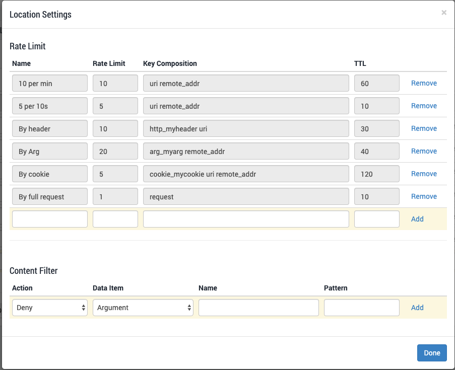
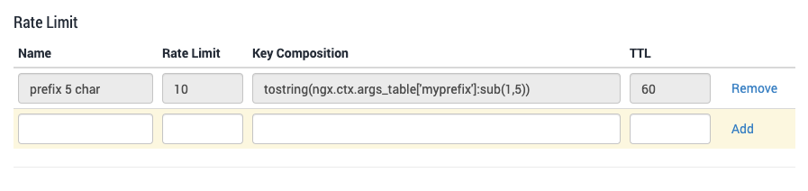
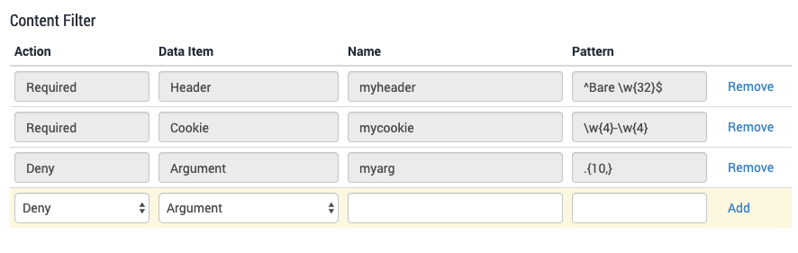

# Security Profiles

In this section, you can:

* \*\*\*\*[**Define different locations**](security-profiles.md#managing-locations) and/or resources within your planet. For each one, you can:
  * \*\*\*\*[**Assign a security Profile**](security-profiles.md#assigning-a-security-profile-to-a-location). Profiles are defined [elsewhere](../../../using-the-product/security/profiles/) in the interface: this section is where you assign them and make them active for different locations within your planet.
  * \*\*\*\*[**Configure rate limiting**](security-profiles.md#setting-rate-limits-for-a-location) ****\(optional\).
  * \*\*\*\*[**Configure content filtering**](security-profiles.md#content-filtering-for-a-location) ****\(optional\).
* \*\*\*\*[**Set a site/application into Report Only mode**](security-profiles.md#enabling-report-only-mode) ****\(usually used only for testing\).

## Managing Locations

The top right part of the screen shows the site that is currently being displayed for editing. 

On the main part of this page, the various defined sections of the selected site are listed. The Default entry is always present.

Each entry is defined as follows:

| Item  | Description |
| :--- | :--- |
| **Name** | A descriptive label that you choose.  |
| **Matching Path** | Defines a Location, i.e. everything within the planet that matches this Path. This entry uses [Pattern Matching Syntax](../../../reference-information-1/pattern-samples.md). |
| **Profile** | The Security Profile assigned to this Location.  |
| **More** | Configures rate limiting for this location, [explained below](security-profiles.md#setting-rate-limits-for-a-location).  |

To add a new Location, fill out the blank entry at the bottom and click Add. To delete a Location, click the Remove link next to its name.

## Assigning a Security Profile to a Location

Once you have defined a Location, you can assign a Security Profile to it.

Within each Location entry, the Profile field is autocomplete. Typing the first few characters of a Profile name will populate the list appropriately, then select the desired Profile.

## Setting Rate Limits for a Location

Once you have defined a Location and assigned a Profile to it, you can also \(if desired\) configure rate limits and content filtering for it.

This is synchronized protection: you can limit the request rate, according to any desired parameter, per URL or section, across the entire cluster, while keeping all the proxy servers in sync.


If you need to whitelist an IP, Country, or ASN from being subject to this rate limiting, see [Whitelisting and Creating Exemptions from Rate Limits](../../../using-the-product/how-do-i.../set-rate-limits.md#whitelisting-and-creating-exemptions-from-rate-limiting).


At the end of the Location's entry, click on "More" to open the Location Settings dialog.



This displays whatever limits have been defined for this location, and another line to add a new limit.


Settings you make in this dialog will only apply to the location associated with the "More" button that opened the dialog.


Each limit defines the number of requests allowed for a specific time period, defined in the TTL field. When a request is received that matches one or more Keys, an internal TTL timer starts, and Reblaze begins counting. If the Rate Limit is reached before the TTL period has ended, subsequent requests are blocked until the current TTL period ends. 

Here are the possible attributes: 

<table>
  <thead>
    <tr>
      <th style="text-align:left">Field</th>
      <th style="text-align:left">Description</th>
    </tr>
  </thead>
  <tbody>
    <tr>
      <td style="text-align:left"><b>Name</b>
      </td>
      <td style="text-align:left">A name that will describe the limit. (This will be shown in the View Logs
        for any requests that are blocked by this limit.)</td>
    </tr>
    <tr>
      <td style="text-align:left"><b>Rate Limit</b>
      </td>
      <td style="text-align:left">Sets the threshold for the requests. This is the number of requests allowed
        per the time period defined in the TTL field.</td>
    </tr>
    <tr>
      <td style="text-align:left"><b>Key Composition </b>
      </td>
      <td style="text-align:left">
        
The value for which Reblaze searches in a request. Explained in <a href="security-profiles.md#key-composition-values"><b>Key Composition</b> <b>Values</b></a> below.

        

      </td>
    </tr>
    <tr>
      <td style="text-align:left"><b>TTL</b>
      </td>
      <td style="text-align:left">The time period in seconds until the request count will be reset.</td>
    </tr>
  </tbody>
</table>### Key Composition Values

When counting the number of requests, Reblaze searches for the value of a Key. Each value has its own cumulative count. 

Combining Keys into one rate limit \(by entering their names together, separated by a space\) allows for more granularity. Examples:

* `remote_addr` : Each IP will have its incoming requests counted, and evaluated separately against the Rate Limit. 
* `remote_addr uri` Each combination of IP and URI will be counted, and evaluated separately against the Rate Limit. In other words, Reblaze will count the requests from each IP for each URI, maintaining separate cumulative counts for each combination. So, if a specific IP asks for multiple pages within a site, it will be allowed; but if it asks for the same page too many times, it will be blocked.

Here are the possible values for **Key Composition**.

| Value | Description |
| :--- | :--- |
| **remote\_addr** | The request's source IP address. |
| **request\_uri** | The request URI. |
| **http\_HeaderName** | Arbitrary request header field; the last part of a variable name is the field name converted to lowercase with dashes replaced by underscores. |
| **arg\_ArgName** | The name of an argument in the request. \(See warning below.\) |
| **cookie\_CookieName** | The name of a cookie. |
| **request** | The full original request line \(including the query string\). |
| **Custom** | See below for explanation: [**Advanced String Manipulation in the Key Composition**](security-profiles.md#advanced-string-manipulation-in-the-key-composition)**.**  |


When using an argument in a rate limit \(as mentioned in the **arg\_ArgName** description above\), the argument becomes **mandatory**. Any request received without the argument will be blocked.


### Advanced String Manipulation in the Key Composition

You can use Lua to manipulate strings in the Key Composition field. Use the `tostring()` function to return a string into the field.

Usually there will also be a substring operation. This should come after the `tostring()`. Example:  `tostring():sub(1, 20)`

Inside the `tostring()`, there must be a valid NGINX variable, usually from ngx.var or ngx.ctx. The full variables list can be found [here](http://nginx.org/en/docs/varindex.html).

Examples:

* Substring - Suffix last 5 char :  `tostring(ngx.ctx.args_table['foo']):sub(-,5)`
* Substring - Prefix from 1st char to 5th char: `tostring(ngx.ctx.args_table['foo']):sub(1,5)`

If you need assistance with this feature, please feel free to [contact support](../../../support.md#contact-information).

## Content Filtering for a Location

For each Location, along with defining rate limits, you can also set up content filtering.

This is a powerful feature that allows you to require, or deny, exact values for specific headers, cookies, and arguments, based on regex matching. 

**Content filter example**

The Filters do not have user-assigned descriptions or names \(the Name field has a different meaning, described below\) When a request is blocked based on the Content Filter, the request appears in the logs with a custom description constructed from the Filter's parameters.

| **Parameter** | **Comments** |
| :--- | :--- |
| **Action** | **Required** to block if a match from the specified Pattern is not found. **Deny** to block if a match is found. |
| **Data Item** | The source of content to examine. Options: Argument, Header, Cookie. |
| **Name** | The name of the Data Item from which to get the content. |
| **Pattern** | The matching conditions, specified as regex. |

To add a new Filter, enter values into the empty row in the list and click Add. Existing Filters can be deleted by clicking Remove. 

When you are finished configuring rate limits and content filtering for a location, click Done. After you have edited all Locations, [Save Changes and Publish Changes](../../../using-the-product/best-practices/publish-your-changes.md).

## Enabling Report-Only Mode

At the bottom of the screen, the Report Only switch allows you to test your Reblaze configuration. Enabling this setting means that Reblaze will not block any traffic for this site/application; it will merely report on what it would have blocked otherwise. This is useful during a new deployment, since you can fine-tune and optimize your settings while avoiding false positives.


This setting applies to the site/application currently being displayed. It is the same setting that is available for this site/application on the [Planet Overview](../planet-overview.md) page. See the warning there about this setting.


