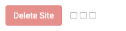

# General Settings

This part of the interface allows administration of three categories of settings, for the site that is currently selected at the top of the screen:

1. [Upstream Servers](web-proxy-general-settings.md#upstream-servers)
2. [Proxy Settings](web-proxy-general-settings.md#proxy-settings)
3. [Log File Parameters](web-proxy-general-settings.md#log-file-parameters)

At the bottom, it also provides [the ability to delete the selected site](web-proxy-general-settings.md#site-deletion) from the planet.

## **Upstream Servers**

This section defines the servers that Reblaze will protect. In other words, these are the servers to which Reblaze will send the \(legitimate\) traffic it receives.

**Within these settings, you can:**

* Enable and configure load balancing, weighting and distributing traffic across your primary servers. 
* Define backup servers, to which Reblaze will failover your traffic when your primary servers aren’t available. 
* Take servers offline for maintenance by ticking a single box in the interface. 
* Instruct Reblaze to keep individual users connected to the same server throughout their sessions. 

Adding and deleting servers from this list is straightforward. To add a server, enter its IP in the “New Server” box and click **Add**, then fill out the rest of the information in the new entry. To delete an existing entry, click on the **Delete** link next to that entry.

The settings for each server in the list are as follows.

| **Attribute** | **Description**  |
| :--- | :--- |
| **Host** | The IP address for each server that Reblaze protects. This can be a normal web server, or it can be a load-balancer. Note that Reblaze also provides load-balancing capabilities in its own right, as seen in the next field. |
| **Weight** | The relative weight of each server for load-balancing purposes. Reblaze distributes traffic with a round-robin sequence, according to these weights. For example, if two servers are both set to 'weight=1', they will receive equal amounts of traffic. If the first is set to 'weight=3' while the second is set to 'weight=1', the first server will receive three visitors for every single visitor that the second server receives. |
| **Max Fails** | The maximum number of failed communication attempts that are allowed for this server. Once this number of failures occurs, Reblaze will consider the server to be inactive. If other servers are available, Reblaze will failover the traffic to them. If this was the only  server available, Reblaze will return an error to the client \(either 504 Timeout, or 502 Bad Gateway\). |
| **Fail Timeout** | When a server fails, this is the length of time that Reblaze will wait before trying to send traffic to it again. Example: "10s" indicates a fail timeout of 10 seconds. This field uses [TTL Expression Syntax](../../../reference-information-1/custom-ttl-values.md). |
| **Is Down**   | When this box is checked, Reblaze will not attempt to communicate with this server. This allows you to easily take a server offline for temporary maintenance or some other purpose. |
| **Is Backup** | When this box is checked, Reblaze will treat this server as a backup. In other words, Reblaze will not attempt to communicate with it unless all the primary servers \(i.e., those for which this box is not checked\) are unavailable. |
| **HTTP Port** | The HTTP port for the server. |
| **HTTPS Port** | The HTTPS port for the server. |


In addition to the features described above, Reblaze also has a stickiness capability that is not exposed in this version of the interface. Sometimes an application requires a user to be connected to the same server throughout the session. Reblaze can ensure that this occurs, and can do so using a variety of methods \(tracking the user by IP address, session cookies, geographic location, and more\).

The stickiness feature will be added to the Reblaze interface in a future version. Meanwhile, if you need this capability for your deployment, contact Reblaze support to set it up for you.


## Proxy Settings

The Proxy Settings parameters define Reblaze’s behavior as a proxy, i.e. how Reblaze passes information back and forth between client and server.

<table>
  <thead>
    <tr>
      <th style="text-align:left">Setting</th>
      <th style="text-align:left">Description</th>
    </tr>
  </thead>
  <tbody>
    <tr>
      <td style="text-align:left"><b>Host Header</b>
      </td>
      <td style="text-align:left">Defines whether or not Reblaze will alter the Host field in the request
        header. The default value (&#x201C;$host&#x201D;) means that Reblaze will
        not change it; the server will receive the Host field that the client sent.
        A different string will replace the Host field in the header. For example,
        if you have multiple domains in your Reblaze planet, you might mandate
        that all incoming requests have a certain domain in the header, regardless
        of which domain the client is actually accessing.</td>
    </tr>
    <tr>
      <td style="text-align:left"><b>Client&#x2019;s IP Header Name  (Upstream Side)</b>
      </td>
      <td style="text-align:left">Defines the field name that contains the client&apos;s IP address. Reblaze
        is a proxy, and it passes incoming client requests to the upstream server.
        This means that the server will receive request headers which contain Reblaze&apos;s
        cloud IP address as the &quot;client&quot; IP. This is not useful; almost
        always, the server will need the IP of the actual client instead. To facilitate
        server logging, analytics, and so on, Reblaze adds the IP address of the
        originating client to the headers that it sends to the server. The <b>Client&#x2019;s IP Header Name (Upstream Side)</b> entry
        allows you to define the name of the field within which this information
        is passed.</td>
    </tr>
    <tr>
      <td style="text-align:left"><b>Client&apos;s IP Header Name (Client Side)</b>
      </td>
      <td style="text-align:left">Defines one or more header fields within which Reblaze can find the client&apos;s
        IP address. When Reblaze receives an incoming request from a client, the
        request will have passed through a load balancer on its way to Reblaze.
        This means that the header will contain the client&apos;s IP and the load-balancer
        IP. These two IPs are usually found within the X-Forwarded-For field, which
        is the default entry for <b>Client&apos;s IP Header Name (Client Side)</b>.
        In this situation, Reblaze knows how to extract the client IP from this
        field. In other situations, a different field name might be necessary.
        For example, if the Reblaze customer is using Akamai CDN, the incoming
        request will have the client IP in a field named True-Client-IP instead.</td>
    </tr>
    <tr>
      <td style="text-align:left"><b>Domain Names</b>
      </td>
      <td style="text-align:left">The list of domains that Reblaze will protect.</td>
    </tr>
    <tr>
      <td style="text-align:left"><b>SSL Offload</b>
      </td>
      <td style="text-align:left">Reblaze can send web traffic via HTTP instead of HTTPS. This improves
        server performance, because the server no longer needs to decrypt the traffic.
        Obviously, this decreases security, and so this setting should usually
        be disabled. However, under certain circumstances (e.g., when a VPN is
        established between Reblaze and the servers), it can make sense to enable
        this.</td>
    </tr>
    <tr>
      <td style="text-align:left"><b>Connect Timeout</b>
      </td>
      <td style="text-align:left">The time (in seconds) for Reblaze to wait, before treating a connection
        with the upstream server as having failed.</td>
    </tr>
    <tr>
      <td style="text-align:left"><b>Send Timeouts</b>
      </td>
      <td style="text-align:left">The time (in seconds) for Reblaze to wait, before treating an upstream
        data transfer attempt as having failed.</td>
    </tr>
    <tr>
      <td style="text-align:left"><b>Read Timeout</b>
      </td>
      <td style="text-align:left">The time (in seconds) for Reblaze to wait, before treating a downstream
        (toward Reblaze) data transfer attempt as having failed.</td>
    </tr>
    <tr>
      <td style="text-align:left"><b>Mask Headers</b>
      </td>
      <td style="text-align:left">
        
Defines the response headers that Reblaze will mask (i.e., remove from
          the response), preventing them from being exposed to the client.

        

        
For example: a default response header might include information about
          the server software (e.g. &#x201C;Server: Microsoft-IIS/8.5&#x201D;). This
          tells an attacker exactly which platform he is targeting, and so he can
          know which vulnerabilities to exploit. The Mask Headers entry defines all
          the headers to remove. It can contain multiple values, connected by pipes,
          with asterisks as wildcards.

      </td>
    </tr>
    <tr>
      <td style="text-align:left"><b>HTTP/HTTPS redirect lines</b>
         
      </td>
      <td style="text-align:left">Used to redirect all requests coming into these ports.</td>
    </tr>
  </tbody>
</table>#### Additional information

The **Client’s IP Header Name \(Upstream Side\)** setting defines how Reblaze passes the client's IP address to the upstream server. In addition to the IP, Reblaze also sends the client's geographic information \(if it is available\). The field names are:

| Field name | Description |
| :--- | :--- |
| RBZ-GEO-Country | Client's country |
| RBZ-GEO-CountryCode | Abbreviation of client's country |
| RBZ-ORG | Client's organization |
| RBZ-REGION | Client's region |

## Log File Parameters 

The Log Files Parameters enables you to control the contents of the Reblaze-generated traffic logs.

| Log file Parameter | Description  |
| :--- | :--- |
| **Challenge Domain** | Defines the domain you want Reblaze to use when setting a challenge cookie. The default value \(“$host”\) tells Reblaze to use the domain being accessed by the user.  |
| **Private Args** | Defines the argument names which contain sensitive data, and therefore will not be saved in log files. Common examples of this are payment details and credit card numbers. |

## Site Deletion

When you wish to remove a site from Reblaze, select it in the pulldown list in the upper right of the page. Then, at the bottom of the page, you will find a \(disabled\) Delete Site button.

To enable the button, check all three boxes next to it. \(This is a safety measure to prevent accidental site deletions.\) Once the button is enabled, clicking it will remove the specified site from Reblaze. Note that this action cannot be undone.

Before deleting a site from Reblaze, you should change your DNS settings to reroute your traffic, and then wait for the changes to propagate. Otherwise, Reblaze will still be receiving traffic, but the traffic will no longer be passed along to your server.

