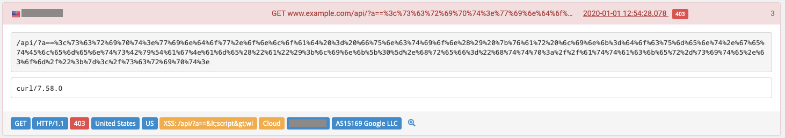
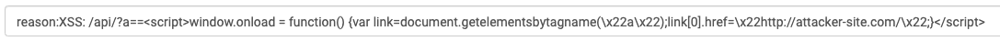
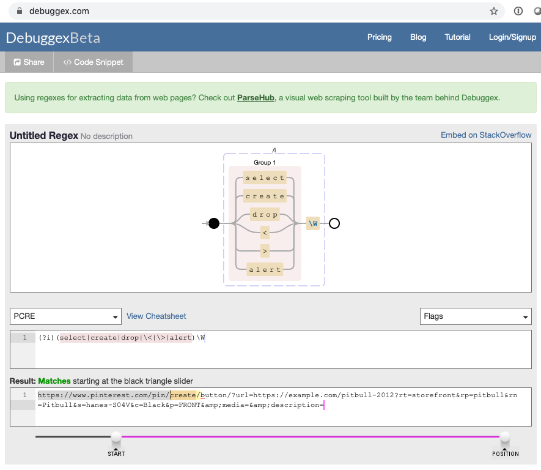

# Understanding and Diagnosing Traffic Issues

## Introduction

A typical security solution provides information about the traffic that it has blocked. Contrary to this, Reblaze shows _all_ of the traffic that it receives.

This provides you with a powerful ability to dig into your traffic data and gain deep understanding about the nature and disposition of incoming requests. 

Metrics about blocked requests are very useful, but their usefulness is multiplied when you can compare them to passed requests. By showing all requests, Reblaze allows you to understand what "normal" requests look like. This gives you more insights into abnormal traffic.


**The discussion below assumes you have already read the best practices for using the Reblaze Query Box.**


That page is available here:



## Gaining General Insights

Reblaze provides multiple ways to view your traffic. The discussion below will focus on the [View Log](../../product-walkthrough/reblaze-traffic/view-log.md). Similar tactics can be applied when viewing different parts of the [Dashboard](../../product-walkthrough/reblaze-traffic/dashboard.md).

Sometimes the View Log is used to answer a specific question about a request or a traffic source. At other times, it might be a more general exploration; for example, a beginning-of-the-day review of what happened over the last 24 hours.

Let's discuss the latter scenario \(a general exploration\). Because the View Log shows all requests, it can be overwhelming. It's helpful to start by excluding requests that aren't as relevant to your current purpose. Examples:

* **Show only blocked requests or challenges**: `is:blocked` \(to show only blocked requests\) or `reason:challenge` \(to show only challenges\).
* **Exclude health monitor checks**:  `url:!/health.htm` \[the URL defined for the [Health Monitor](../../product-walkthrough/settings/planet-overview.md#configuring-health-monitoring)\] 
* **Exclude requests being rejected by the origin** \(i.e., the upstream server\): `reason:!by origin`
* **Exclude requests from a banned IP**: `ip:!1.2.3.4 .` Another approach: `reason:!autoban/etc.`
* **Exclude requests that are obviously invalid**, e.g. those with unrecognized host headers.

Eventually, you can filter the display down to a list of challenges or blocked requests that might produce some insights.

From this point, you are looking for possible patterns, or unusual outliers, and considering possible actions to take. For example:

* **Are there a lot of requests for a Wordpress file, but your site does not use Wordpress?** These are coming from malicious traffic sources. It might be useful to set up a [Dynamic Rule](../../product-walkthrough/security/dynamic-rules.md), e.g. to Ban requestors who submit more than one request for that file in a three-minute period.
* **Is the same IP failing multiple challenges?** It might be interesting to filter on that IP only, and go through all of its activity, to see what that traffic source was trying to do. \(You can see that a challenge is being failed when the challenge itself appears in the logs, but it is not followed by a successful request by the IP for the same URI.\)
* **Are there many blocked requests for the same URI, but from different traffic sources?** This might be a False Positive alarm. See below for more on this.

There is no set procedure for this process. Essentially, you are browsing the list of challenges or blocked requests, thinking about why you are seeing the entries there, and asking further questions.

## Translating Encoding in Requests

Sometimes, request data will be encoded. Here's an example of a XSS attempt.

The script in the request is HTTP encoded. To see it in plain text:

* Double-click on the reason \(the yellow label beginning with XSS\). 
* The full contents of the label will appear in the query box, decoded. 

**For some forms of encoding, more processing is required.** 

* Reblaze does not perform all possible forms of decoding in the interface.
* Double-encoded requests will only have their first level of encoding undone.

In these cases, you can highlight the string in the query box, copy it, and run it through decoding tools. \(For example, [http://0xcc.net/jsescape/](http://0xcc.net/jsescape/).\)

## False Positive Alarms

A “False Positive” \(FP\) alarm occurs when a security system misinterprets a non-malicious activity as an attack. These errors are a critical issue for cybersecurity.

Although it might seem that FP errors do not necessarily have serious consequences, incorrect security alerts can lead to significant monetary losses. For example, an e-commerce site might incorrectly exclude real online shoppers. Or, it might reject "good" web crawlers, which would reduce its Internet visibility.

FP diagnosis is often done when Reblaze is first deployed, before it has been fine-tuned for the customer's applications. It can also be done later, when you discover that certain requests are being blocked, but you do not understand why. 

## **Determining if a block is a FP**

When examining blocked request\(s\), it can be helpful to ask questions such as the following.

#### **Is Reblaze's configuration appropriate for the application?**

Sometimes an application will expect and accept inputs that Reblaze blocks by default. Example: the site might use a CMS which accepts HTML/Javascript POST requests. However, out of the box, Reblaze is often configured to block requests containing POST. Thus, Reblaze would need to be re-configured to match the application it is protecting. \(In this example, it's a simple toggle switch in the WAF/IPS Policies interface.\) 

#### **Has the web application been updated, without Reblaze being updated as well?**

If the range of valid inputs has changed, but Reblaze was not re-configured, then FP errors can result.

**Is the block happening to multiple users?**

If a single IP is being blocked, but other requestors for the same URI are being allowed through, the block is more likely to be the correct response to this IP's request. This is especially true when the single IP has attempted other questionable activities.

Conversely, if multiple requestors are being blocked, and they seem to be innocuous otherwise, this indicates the problem might be a FP.

#### Is the block being done by Reblaze, or is it coming from elsewhere?

There are some situations where a request is blocked even though Reblaze has no obvious reason to be blocking it. This can occur when Reblaze is not actually the entity making the decision.

* **The upstream server can reject requests**. These requests can be displayed in the View Log with`reason:by origin` as the filter. 
* **Reblaze can use ACLs with external sources of information**, e.g. Spamhaus. **Example**: a request is blocked with a reason of `acl-ip`.  The reason indicates a Reblaze ACL blocked the request because of its IP—but what if you didn't configure any ACLs to reject specific IPs? The answer is that there are several ACLs which rely on external lists of hostile IPs, such as Spamhaus DROP and eDrop.

#### Is this a FP that resulted from incorrect user actions?

Example: a web user visited a landing page, entered contact details into a form, and then tried to proceed to the next page. However, the request to proceed was blocked. 

This could be a FP due to "junk input." Perhaps the user entered a phone number of "1111111111" and it was rejected by the upstream application. Or perhaps the page itself autocompleted a field and inadvertently created junk input on its own.

#### Is this a FP that resulted from faulty or too-restrictive parameters within Reblaze?

If requestors are being blocked for violating rate limits, and the rate limits are very stringent, then perhaps the limits are too tight, and they need to be relaxed.

Or, perhaps the block is the result of content filtering. This feature is powerful, and it is possible to mistakenly configure it to be too restrictive.

**Example:** requests are being blocked because of a [Custom Signature](../../product-walkthrough/security/profiles/acl-policies.md#custom-signature) \(`reason:acl-custom-sig`\). 

Looking up the custom signature shows that its "**Is matching with**" condition is the following regex:

`(?i)(select|create|drop|\<|>|alert)\W`

The admin wrote this regex in order to identify SQL injection attempts \(i.e, SELECT, CREATE, and DROP commands\).

Now let's examine one of the blocked requests in the View Log. Its Capture Vector is this:

`https://www.pinterest.com/pin/create/button/?url=https%3A%2F%2Fexample.com%2Fpitbull-2012%3Frt%3Dstorefront%26rp%3Dpitbull%26rn%3DPitbull%26s%3Dhanes-S04V%26c%3DBlack%26p%3DFRONT&amp;media=&amp;description=`

This can be decoded with a tool such as [http://0xcc.net/jsescape/](http://0xcc.net/jsescape/). It now becomes this:

`https://www.pinterest.com/pin/create/button/?url=https://example.com/pitbull-2012?rt=storefront&rp=pitbull&rn=Pitbull&s=hanes-S04V&c=Black&p=FRONT&amp;media=&amp;description=`

Now let's see why the regex condition matched the request. On [https://www.debuggex.com/](https://www.debuggex.com/), it's possible to paste in regex and a string, and see if/where a match occurs.

Notice the highlighted \(in yellow\) part of the string in the bottom textbox. This shows which part of the bottom string matches with the regex in the box above it.

We see that the expression that was meant to identify an SQL command of CREATE, is also matching with the URL generated by a user who was trying to feature this site's product on Pinterest.

This indicates that the regex should probably be modified, so that it only accomplishes its intended purpose. In this example, it could be modified as follows:

`(?i)(\sselect|\screate|\sdrop|\<|>|alert)\W`

This would require a space to be found before each potential SQL command, thus eliminating matches when those words are found in a URL.

## Summary of FP Detection

As mentioned earlier, there is no set procedure for the process of identifying the underlying reasons why requests are blocked. It requires digging into the requests, gathering data, and asking questions.

Hopefully the examples above are helpful in illustrating the necessary thought process, and some of the tools that are available.

