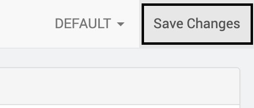
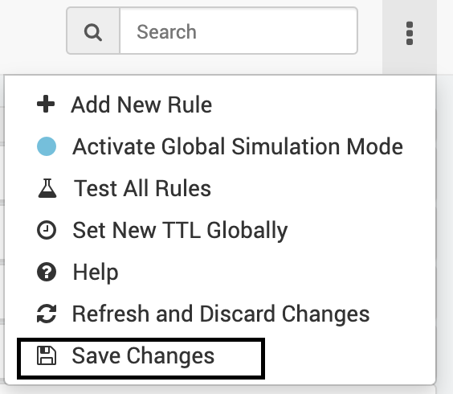

# Saving and Publishing Your Changes

Whenever you change the configuration of the Reblaze platform, **you must save your changes**, and in almost all cases, **you must publish them to the cloud as well**.


If you do not save your changes, they will be lost when you go to a different page within the user interface. You will not be prompted or asked to confirm the abandonment of your changes.


## Saving Changes

The Reblaze interface has several ways in which to save changes.

In many places, this button appears on the upper right part of the screen:

In other places, the Save functionality is part of a pull-down menu, which is designated by three vertical dots:

Remember that you must select Save Changes, in whatever format the button is offered, whenever you make any edits within the Reblaze interface.

Also remember that in almost all cases, Save Changes only saves your changes within your local session. To push them to your planet in the cloud, you must Publish Changes as well.

## Publishing Your Changes

When editing [Dynamic Rules](../../product-walkthrough/security/dynamic-rules.md), saving your changes will apply them to your planet.

In all other cases, after Saving your changes, you will also need to Publish them, which will push everything to the cloud.


Rather than trying to remember which activities require publishing and which do not, it is best to get into the habit of always Publishing after Saving.


In some cases, choosing the Save button will be followed by an immediate prompt to Publish. In other cases, it will not, but Publishing is still required. Again, it is recommended that you adopt the habit of always Publishing after Saving.

Publishing is done on the Planet Overview page, via the button on the upper right. The status of the Publishing process will appear on the bottom right part of the screen.



