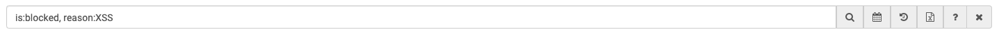
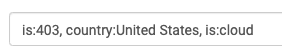

# Using the Reblaze Query Box

## Introduction

The Reblaze query command box allows you to query the data in order to present only the records that you want. The structure of a filter is **operator:value**.

For example, to view only traffic from IP 10.11.12.13:

**`ip:10.11.12.13`**

An exclamation mark \("!"\) can be used with various filters as a "NOT" operator. So, to _exclude_ requests from an IP, add "!" as a prefix: 

**`ip:!10.11.12.13`**

Note that filters can be combined to fine-tune a search, by chaining them with a comma. For example, in order to show all traffic from France that was blocked:

`country:France, is:blocked`

## Building Queries Efficiently


**The fastest way to build query strings is to double-click on labels of existing log entries.** This will add the value of each label as a filter to the query box. When you have constructed the entire query string, click on the search button, or place the cursor into the text field and hit "Return" on your keyboard. 


For example, when looking at this entry for a blocked request \(the IPs have been censored for privacy reasons\):

Let's say you wanted to quickly see what other requests produced a 403 error that came in from the United States on a cloud IP. Double-clicking on the "403" label, the "United States" label, and the "Cloud" label builds the query string for you automatically:

Then select the "search" button, or place the cursor within the query box and hit "Return" on your keyboard, to process the query.

In some situations, this technique has limited usefulness. In the example screenshot above, double-clicking on the label beginning with "XSS" would add a \(very\) long filter string to the query, because that label contains the full script from the injection attempt \(although the label itself only displays the first few characters in the interface\).

If this is what you want \(perhaps you need to search only for logged requests which contain that exact script\), then this is effective. But if you wanted to build a more general query, then this is not useful.

A better approach is to choose a representative substring. 


**Queries can be based on substrings.** Internally, Reblaze executes a "contains" search, so queries will return everything that contains the string that was specified. 

In some situations, you'll want to build queries that produce exact matches. But in many other situations, it's faster just to search for a relevant substring instead. 


Examples:

* `reason:XSS` will show all records with "XSS" in their reason label.
* `url:login` will include all URLs that include "login".
* `ip:191` will display all IP addresses containing "191".

## Filter Use Cases and Examples

**Regular expressions** can be applied to the filter value to make the search more accurate. The regex matching is done by wrapping the search value with re\(REGEX here\). Examples: 

`is:re(200|401)`

`ua:re(iOS!iPhone!iPad)`

If you wish to display login requests with method “POST” which were blocked, but not by the origin \(upstream server\): 

`url:/login,is:POST,is:blocked,is:!origin.`

This displays those requests which produced 502-504 error codes:

**`is:re(502|504)`**

This displays the requests that contain a specific value in an argument:

**`arg_name:text, arg_value:free_text`**

## **Available filters** 

| **Name** | **Explanation** |
| :--- | :--- |
| **After** | Log records registered after a given date and time. |
| **Before** | Log records registered before a given date and time. |
| **arg\_name** | Search for an argument by name |
| **arg\_value** | Search for an argument value  |
| **asn** | Autonomous System Number for the IP |
| **city** | Abbreviation for the country. Example: "US" for the United States. |
| **country** | Name of the country |
| **cookie\_rbzid** | Reblaze ID cookie value \(base64\) |
| **cookie\_name** | Search by cookie name |
| **cookie\_value** | Search by cookie value |
| **domain\_name** | The main domain name in Reblaze \(not necessarily the actual Host header\). |
| **ext** | File extension |
| **header\_name** | Name of header |
| **header\_value** | Value found in header\_name |
| **host** | HTTP Host header: usually, the domain name of the application. |
| **id** | Reblaze unique request ID. |
| **ip** | IP address of the web client. |
| **is** | IS is a special operator that can be used for almost all attributes of a request. It can be used to filter a certain HTTP method, "flags" and protocol version. For instance, to get blocked POST requests made by a human, type: is:blocked, is:human, is:post. |
| **mime** | Multipurpose Internet Mail Extensions |
| **origin** | The IP address of the origin server. |
| **path** | The path of the request \(the URL without the query string part\). |
| **proxy** | The IP address of the particular Reblazer server. |
| **rbzid** | Hash value of Reblaze ID cookie value \(md5\). |
| **reason** | Reason the request was blocked or passed. |
| **ref** | HTTP referer header. |
| **sslcipher** | The chosen SSL cipher. |
| **sslprotocol** | The chosen SSL protocol. |
| **status** | Response status code \(regex is acceptable, e.g. \[45\]\d\d\). |
| **ua** | HTTP User Agent header. |
| **upstream\_status** | Response status code from upstream servers \(regex is acceptable, e.g. \[45\]\d\d\). |
| **url** | A substring to search for within the complete URL request line \(including the query string\). |

