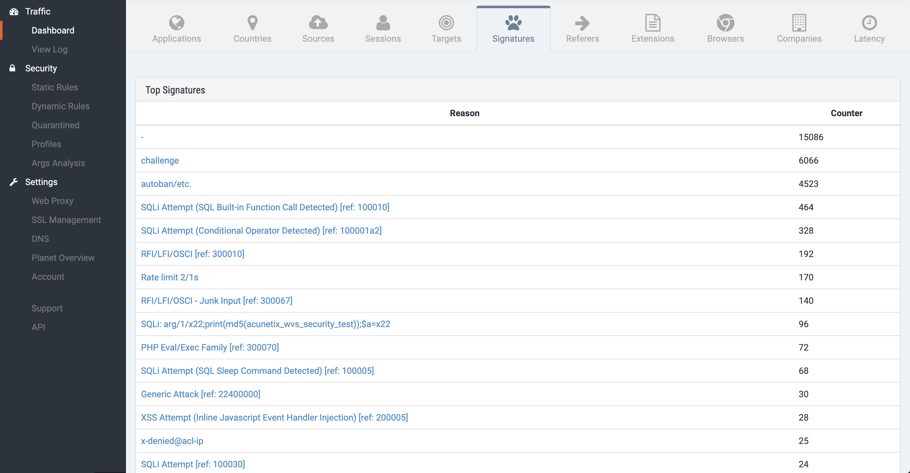
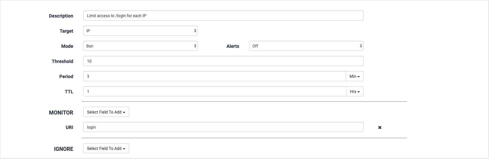
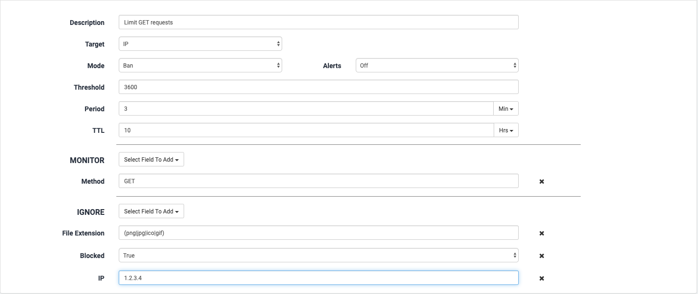

# Dynamic Rules

## Overview

The Dynamic Rules section defines security rulesets that evaluate various criteria over time. When requestors commit activities that exceed defined thresholds, they can be banned, or merely reported on within the interface. 

Note that **Dynamic Rules do not block requests; they ban the** _**sources**_ **of requests**. Individual incoming requests are blocked for reasons defined elsewhere, e.g., in [ACL Policies](profiles/acl-policies.md). 

When requests are blocked, or display other hostile characteristics, Dynamic Rules are used to monitor their sources. If the sources continue their hostile activities, they can be banned. A ban means that **all subsequent requests from that source will be blocked for a configured length of time**. 

The interface displays the Dynamic Rules that are currently defined. At the top are the default rules supplied by Reblaze, marked with the Reblaze icon. 


The default rules from Reblaze are useful for most customer deployments. If you wish to edit them, one approach is to preserve the originals by duplicating them, deactivating them, and then editing and using the copies.


## Dynamic Rules Administration

To edit a rule, click on its name, and its parameters will appear below.

To disable or enable a rule, click on the Activation trigger:  

To delete a rule, click on the small button at the end of its listing: That button will display options to Delete this rule, or to Duplicate it. \(Sometimes, it is faster to Duplicate a rule and edit the copy than to create a new one from scratch.\)

### Dynamic Rules section menu

At the top right screen, this larger button is shown : . Clicking on it will cause the section menu to appear:

It provides these abilities:

| Name | Description |
| :--- | :--- |
| **Add new rule** | Creates a new Dynamic Rule. |
| **Activate global simulation mode** | The rules currently set to "Ban" will be changed to “Simulated Ban”. This is useful for testing. See also [How to Test Dynamic Rules](dynamic-rules.md#how-to-test-dynamic-rules), below. |
| **Test All Rules** | Explained in [How to Test Dynamic Rules](dynamic-rules.md#how-to-test-dynamic-rules), below.  |
| **Set new TTL globally** | Sets TTL \(described below in [Dynamic Rules settings](dynamic-rules.md#dynamic-rule-settings)\) for all Dynamic Rules. |
| **Help** | Brings up a help screen describing the settings for a rule. See also [Dynamic Rules settings](dynamic-rules.md#dynamic-rule-settings)**,** below. |
| **Refresh and discard changes** | Discards all changes that you have made, and refreshes the display to show the current settings within the system.  |
| **Save Changes** | Saves all changes that have been made. Note that this makes your changes go live immediately. Unlike other administrative activities within Reblaze, when editing Dynamic Rules it is not necessary to Publish Changes after saving them. |

The interface also provides a search box, which can be used to find a rule according to a string within its name.

## Creating Dynamic Rules

To create a Dynamic Rule, click on "Add new rule" in the Dynamic Rules section menu and provide the Rule Name. 


Newly-created Rules are always disabled, and must be enabled before they will be active. 


## Dynamic Rule settings

Each Dynamic Rule contains the following parameters:

<table>
  <thead>
    <tr>
      <th style="text-align:left">Field Name</th>
      <th style="text-align:left">Description</th>
    </tr>
  </thead>
  <tbody>
    <tr>
      <td style="text-align:left"><b>Description</b>
      </td>
      <td style="text-align:left">Your description of the rule. This is useful for internal purposes, e.g.,
        noting why a particular rule is necessary.</td>
    </tr>
    <tr>
      <td style="text-align:left"><b>Target</b>
      </td>
      <td style="text-align:left">Defines the source of aggregated requests which will be evaluated, and
        the recipient of the specified action if a violation occurs. The most commonly-used
        target is IP. Other options are Cookies, Country, ASN, Planet, Request
        Body, Request Header, or User Agent. (&quot;Planet&quot; means &quot;all
        requests.&quot; This is used in the Global Request Count default rule.)</td>
    </tr>
    <tr>
      <td style="text-align:left"><b>Alert</b>
      </td>
      <td style="text-align:left">If a notification should be sent when a violation of this rule occurs.</td>
    </tr>
    <tr>
      <td style="text-align:left"><b>Mode</b>
      </td>
      <td style="text-align:left">
        
Defines the action that will happen when a requestor exceeds the specified
          Threshold during the Period.

        

        
<b>Ban </b>will block the violator (available for IP, Cookie, Request
          Body, Request Header, Country, and ASN), and will add the violator to the
          <a
          href="quarantined.md#banlist">Quarantined Banlist</a>.

        

        
<b>Simulated Ban </b>does not actively ban the violator; it only adds
          the violator to the <a href="quarantined.md#simulation-banlist">Quarantined Simulation Banlist</a>.

        

        
<b>Report Only</b> does not actively ban the violator. If this rule has
          been included within a <a href="../../product-walkthrough/settings/planet-overview.md#notification-and-alert-settings">Notification Group</a>,
          then the defined notifications will be sent.

      </td>
    </tr>
    <tr>
      <td style="text-align:left"><b>Threshold</b>
      </td>
      <td style="text-align:left">The maximum allowable number of http/s requests by the Target in the specified
        Period.</td>
    </tr>
    <tr>
      <td style="text-align:left"><b>Period</b>
      </td>
      <td style="text-align:left">The time period within which requests will be counted, and if the Threshold
        is exceeded, will trigger the defined action. <b>Note that each Period should be 3 minutes or longer. </b>(A
        few example screenshots in this Manual have shorter periods. These were
        taken from a demo site, and are for illustration only. Periods in a production
        deployment should be 3 minutes or more.)</td>
    </tr>
    <tr>
      <td style="text-align:left"><b>TTL</b>
      </td>
      <td style="text-align:left">Time To Live: If the violator is banned, this is the length of the ban.
        If the violation is merely reported (as in Report Only mode), this is the
        amount of time before a new report can be issued on this violation.</td>
    </tr>
    <tr>
      <td style="text-align:left"><b>Monitor</b>
      </td>
      <td style="text-align:left">A list of matching conditions. If a request matches <b>all</b> the conditions
        in this list, it will be included in the aggregated count toward a potential
        violation. Multiple conditions are ANDed together. See further discussion
        below.</td>
    </tr>
    <tr>
      <td style="text-align:left"><b>Ignore</b>
      </td>
      <td style="text-align:left">A list of matching conditions. If a request matches <b>any</b> of the conditions
        on this list, it will be ignored, and will not be included in the count
        toward a potential violation. Multiple conditions are ORed together. See
        further discussion below.</td>
    </tr>
  </tbody>
</table>
Note that it is theoretically possible to construct a Dynamic Rule so that a specific request can match **both** the Monitor and Ignored conditions simultaneously. \(This usually indicates a mistake in constructing the rule.\) If a request ever matches both condition sets at the same time, nothing happens. 


## **Matching Conditions for Dynamic Rules**

The monitor list includes many useful arguments for identifying relevant traffic. 


Some of the matches rely on the results of [ACL Policies](profiles/acl-policies.md). For example, an **Anonymizer** value of "true" will match a request that was denied by the "Deny Anonymous Proxies" ACL Policy.


| Field Name | Description |
| :--- | :--- |
| **Block Reason** | The reason for the traffic being blocked. See **Defining Block Reasons** below for a full explanation.  |
| **Blocked** | True if the request was blocked, otherwise False.  |
| **Cookie** | An exact match of the cookie name and value.  |
| **Domain Name** | Which domain names should be monitored. |
| **File Extension** | Which file extensions should be monitored. Example: \(exe\|jpg\|tar\) |
| **City** | The abbreviation of the country. Example: "US" for "United States." |
| **Country** | Country name. |
| **Host Name** | Any name that was configured as Host. |
| **Reblazer ID** | ID of the Reblaze proxy  |
| **Anonymizer** | Boolean value \(True/False\) |
| **Cloud** | Boolean value \(True/False\) |
| **Human** | Boolean value \(True/False\) |
| **Proxy** | Boolean value \(True/False\). \[This is different than the Anonymizer field above. It uses an internal value of Reblaze that is not otherwise exposed in the interface.\] |
| **TOR** | Boolean value \(True/False\) |
| **VPN** | Boolean Value \(True/False\) |
| **Method** | HTTP method type \(e.g., GET, POST, etc.\).  |
| **ASN** | The ASN Value. |
| **Referer** | The Referer value. |
| **IP** | The IP Address. |
| **Complete URL** | URL with the query string. |
| **URI** | URI |
| **Request Body** | The name of a field and its value, separated by a space. |
| **Request**  **Headers**  | The name of a field and its value, separated by a space. |
| **Response Status** | HTTP response code \(200, 404 etc.\). |
| **User Agent** | The request's user agent name. |


Scrolling down the list will reveal additional fields. These tend to be used by more advanced users. 


The video below sums it all up:



### **Defining Block Reasons**

The Block Reason field allows you to construct a Dynamic Rule that will be triggered when requests are blocked for specific reasons. When this is included in a Rule, Reblaze will compare its value to the reasons that a request was blocked.

The comparison is based on a "contains" substring search, and is case-insensitive. Therefore, when a request is blocked for `Over-capacity`, Block Reason values of `capacity`, `over-capacity`, and `Over-capacity` will all match.

There can be multiple Block Reasons OR'd together, e.g.: `autoban|over-capacity`. 

There are several ways to obtain values for constructing Block Reasons. The first is the list of standard [Reblaze WAF signatures](../../reference-information-1/reblaze-signatures.md) \(example: `Autoban/etc.`\). Other possible values are custom, created dynamically by Reblaze as the result of user configuration. Example: `Rate limit 2/1s` . 

In both cases, recent values can be obtained from individual events in the [View Log](../../product-walkthrough/reblaze-traffic/view-log.md), or from the Signatures tab on the [Dashboard](../../product-walkthrough/reblaze-traffic/dashboard.md) page.

## **How to Test Dynamic Rules**

After creating or modifying Dynamic Rules, it is recommended that you test them to ensure that they are behaving as expected.

You can safely test Dynamic Rules against actual traffic data, without actually banning any traffic sources. This is done by running the rules in **Simulated Ban** mode.

There are two ways to do this: testing all rules globally \(most useful when setting up a new planet\), or testing individual rules \(useful in daily operation\).

### Testing all rules globally

Select **Activate global simulation mode** from the section menu, which will change all Dynamic Rules that were set to **Ban** to **Simulated Ban**. 

This means that requestors who violate Dynamic Rules will not be banned; instead, they will appear within the [Simulation Ban List](quarantined.md#simulation-banlist) in the [Quarantined](quarantined.md) section. You can observe the requestors who appear there, and evaluate if the Dynamic Rules are identifying the requestors you expected. 


Note that during this process, **all Dynamic Rule traffic scrubbing will be disabled**. Therefore, it is most useful during the initial setup of a new planet.


### Testing individual rules

To test individual rules, set each one to **Simulated Ban** mode. Save and Publish your changes. Then from the section menu, choose **Test All Rules.**

This will evaluate the current set of Dynamic Rules against the most recent traffic data. **Example**: a rule with a Period of five minutes will be evaluated against the requests that were received in the last five minutes. 

You can compare each rule's performance with what you expected. Once you are satisfied with a rule's performance, you can make it active by changing its mode to **Ban**. 

Note that you can accomplish a similar result by observing the Simulated Ban list in the Quarantined section. However, testing is faster using **Test All Rules**: you get the results immediately, instead of having to wait for a full Period to see how a Rule performed.

## **Examples of Dynamic Rules** 

### **Rate-limiting access to a specific URL**

In the example below, this Dynamic Rule limits the number of requests that are sent to `/login` from a specific IP. 

Limiting could also be done globally for all IPs by changing the Target to "Planet."

### **Using cookies to ban an attacker who is switching IPs**

By using a cookie threshold, it is possible to eliminate Denial Of Service attacks originating from the same session, even if the attacker is changing IP addresses. In the screenshot below, requests are counted toward the threshold if they have the same value for the "rbzid" cookie. Requests are not counted toward the threshold if they were Bypassed by an ACL, or if the requestor has already been banned. 

### Rate-limiting specific HTTP requests

This rule blocks HTTP GET requests from a specific IP for 10 hours, under these conditions:

* The IP has submitted more than 3600 GET requests in the previous three minutes.
* The requests were not for a static file \(.png , .jpg, .ico, .gif\).
* The requests were not already blocked
* The requests were not from IP 1.2.3.4.

